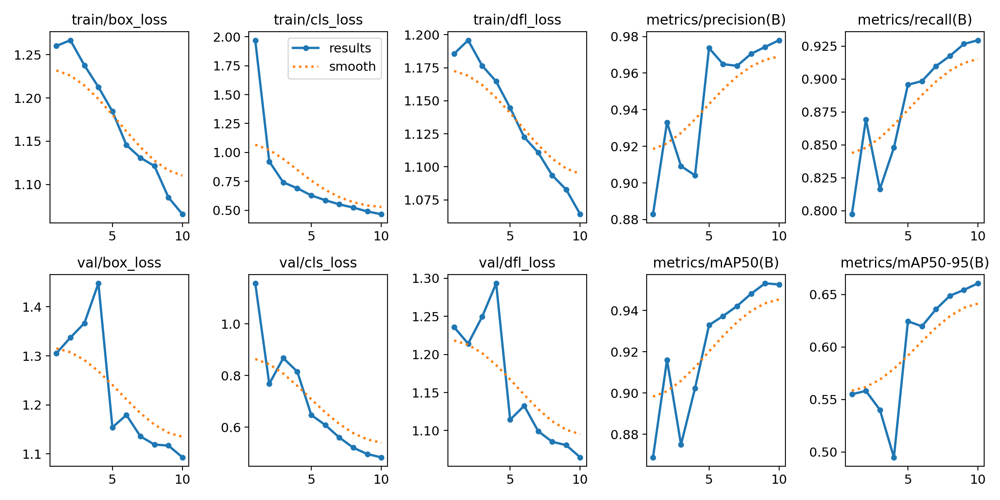
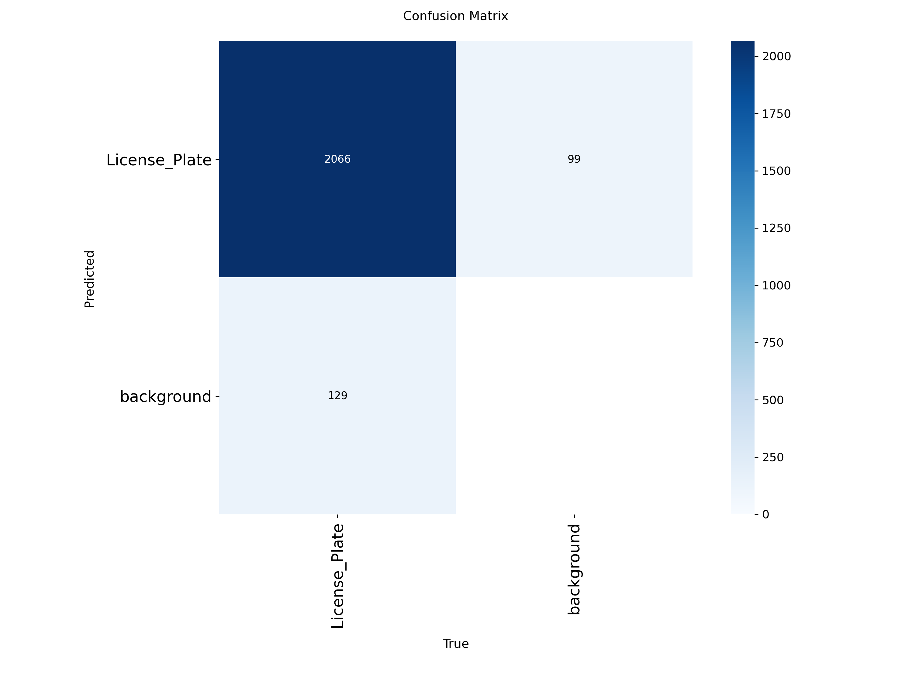
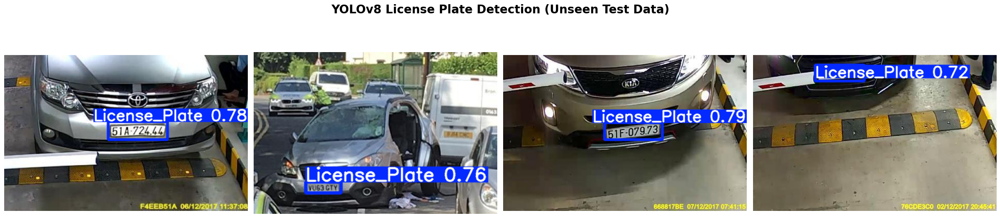
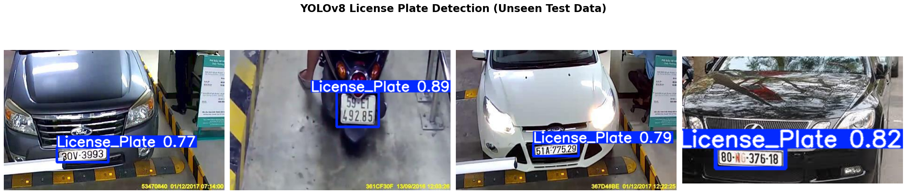
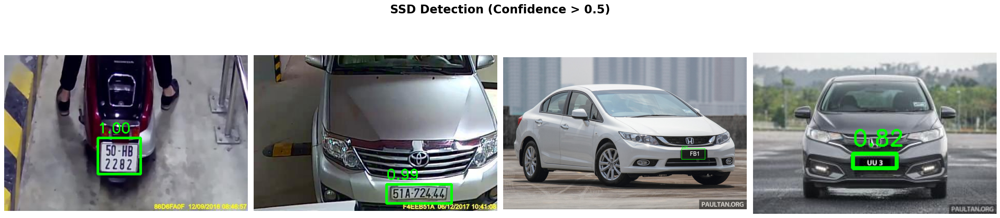

# License Plate Detection

This repository contains the notebook used for the license plate detection project.

## Results

### YOLOv8 Training Curves

### YOLOv8 Confusion Matrix

### YOLOv8 Inference Samples

### Faster R-CNN Inference Samples

### SSD Inference Samples

## Notebook

- `License_plate_detection.ipynb`

## Images

The screenshots used above are stored in the `images/` folder so they render directly in GitHub.

## Notes

- Set `NGROK_AUTH_TOKEN` as an environment variable before running the Streamlit/Ngrok cell.
- The notebook includes training, evaluation, and deployment steps for YOLOv8, Faster R-CNN, and SSD.